# Talos

[](https://maven-badges.herokuapp.com/maven-central/net.microfalx.talos/talos/)

A repository for various Maven plugins and extensions.

## Plugins

### Containers

While there are several alternatives available for Java projects, one of the most well-known options is the one developed by Google. However, I needed a simpler setup.

The plugin still utilizes Docker for building, but this is not an issue for most users. It eliminates the need for custom Docker build commands and includes a library that manages the application startup (setting up the classpath and other JVM arguments).

The only required parameter to package a Java application into a container image is as follows:

- **image**: The name of the image (the tag is generated from the application version)
- **repository**: the name of the repository (if hostname is not provided, it is presumed `docker.io`); a <server></server> with an id equal to the contained of the repository tag.
- **mainClass**: The application class (which runs the application)

The parameters are declared as with any Maven plugins, in the <build></build> section of your POM. 

```xml
<plugin>
    <groupId>net.microfalx.talos</groupId>
    <artifactId>talos-maven-plugin</artifactId>
    <version>0.8.3</version>
    <executions>
        <execution>
            <id>container</id>
            <goals>
                <goal>package</goal>
            </goals>
            <configuration>
                <image></image>
                <repository></repository>
                <mainClass></mainClass>
            </configuration>
        </execution>
    </executions>
</plugin>
```

## Extension

I have used Maven as my build tool for over 15 years. While it is not perfect, it performs remarkably well for projects ranging from small to highly complex. However, there are a few aspects I wish were different, many of which have been echoed by other developers over the years in the issues they’ve logged.

### Logging  

Maven's verbose logging style provides users with insight into actions being performed, but it can be overwhelming when unnecessary details are included. The difference between verbose output and what I refer to as _quiet mode_, which displays hardly any information, is limited.

### Performance

To improve efficiency, developers and CI/CD engineers should not only minimize unnecessary logging but also pinpoint the slower or problematic areas of the build process. Although CI/CD systems provide overall metrics on build times, they often lack detailed insights into where the time is actually spent.

To address this, a report should be generated at the end of the build. This report should come in two formats: one for the terminal and another in HTML, which contains more detailed information. It should indicate the total time taken by plugins (which perform most of the work), repository access, and any other activities that may significantly impact build times.

### Reporting

A concise summary report should be displayed in the console, highlighting how time is being utilized and the results of any run tests. Additionally, a detailed HTML report should be generated, offering in-depth information about each part of the build. This report can also be integrated into the CI tool for each build.

While Gradle addresses many of these concerns, I have not fully embraced that build tool.

Ultimately, I decided to stick with Maven, make improvements, and contribute back to the community. This extension aims to provide the functionalities I need and, hopefully, will be helpful to others as well.

### Use It

To use this extension, it must be registered with Maven's extension support. Add the following XML to _.mvn/extensions.xml_, or append it to your existing file if other extensions are in use (make sure to replace the version as needed):

```xml
<extensions>
    <extension>
        <groupId>net.microfalx.talos</groupId>
        <artifactId>talos-maven-extension</artifactId>
        <version>0.8.3</version>
    </extension>
</extensions>
```

Once the registration is complete, the behavior of subsequent executions of any Maven goal will change.

First, you will notice a decrease in logging output. There will be a brief description of what is being built, along with the main build parameters such as profiles and goals. Each module will be summarized in a single line. The primary Mojos will be logged with brief keywords, while any additional Mojos will be indicated by a single dot (`.`). 

Second, after the build completes, a summary report will be logged. This report will provide all developers with the essential information they need. The report is organized in a few sections:

* First section (after `Build Report for`) displays information about various build phases but also information about additional time spend by Maven: time spent in extension, local and remote repository, etc.
* The second section (`Tasks`) displays information about Mojos. The name is made out by beautifying the Mojo simple class name and in some cases a bit of some hard-coded mapping.
* The third section (`Tests`) displays information about executed tests (if enabled) by module.

Additional information can be requested by using `talos.verbose=true` option, if needed.

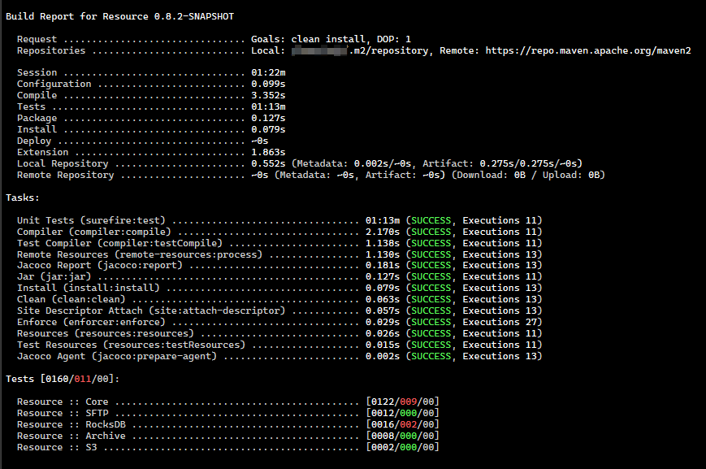

Additionally, an HTML report will be generated in the target directory (top level for multi-module projects). This report can be opened for detailed inspection and integrated with CI tools as needed.

### HTML Report

The HTML report (`build.report.html`) available in top level target directory is a single file HTML page which can be stored in CI/CD or sent over email. All required artifacts are pulled from CNDs so internet access is required to see the report.

#### Summary

This section displays the same information we have in the terminal, but in HTML format and with additional information.

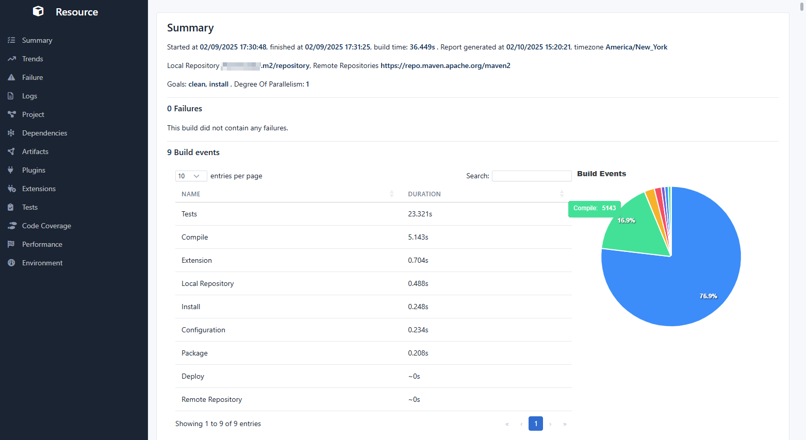

The following information is summarized below:

- **Failures**: This section will always be empty unless the build fails or there are issues with the extension. If a failure is detected, it will be displayed by module, along with the exception class and message. The stack trace can be shown for additional details if needed.
- **Build Events**: This section presents the same information available in the terminal regarding the time spent on Maven lifecycle events, as well as the time spent on extensions and repositories, displayed in both table format and a pie chart.
- **Modules**: A list of modules for multi-module projects.
- **Tests**: A summary of test outcomes organized by module, including several pie charts.
- **Tasks**: A summary of the Mojos executed during the build, including their total and average duration.
- **Dependencies**: A list of direct dependencies registered across all modules, while transitive dependencies are listed in the Dependencies section.
- **Plugins**: A list of plugins registered in all modules, with more detailed information provided under the Plugins section.

#### Trend

Trends display historical data over time, with a default of one data point per day, but are limited to a maximum number of configured days.


All key performance metrics for each session are stored locally on disk and can also be saved to a remote file system if needed. When generating the report for the current session, all relevant trends are downloaded (if necessary) and presented in this section.

The information available in this section can help identify which part of the build process is impacted and potentially why that is the case.

The section organizes trends into three categories:

- **Maven**: All aspects related to Maven
- **Server**: Historical metrics on server performance
- **Process**: Historical metrics on process performance

#### Failure

Unless a failure (in build process or extension) is detected, this section will be empty.

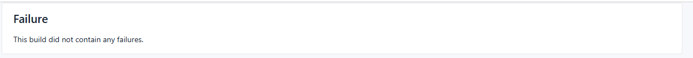

When a failure occurs, the following information will be displayed:
- **Module**: The module that was in the process of building when the failure was detected.
- **Exception Class**: The class of the root cause of the exception.
- **Error Message**: The message associated with the root cause exception.
- **Stack Trace**: The stack trace is hidden by default but can be expanded using a button.

#### Logs

The complete build logs are captured and attached with syntax highlighting, like in the terminal, unless disabled with the `-B` flag.

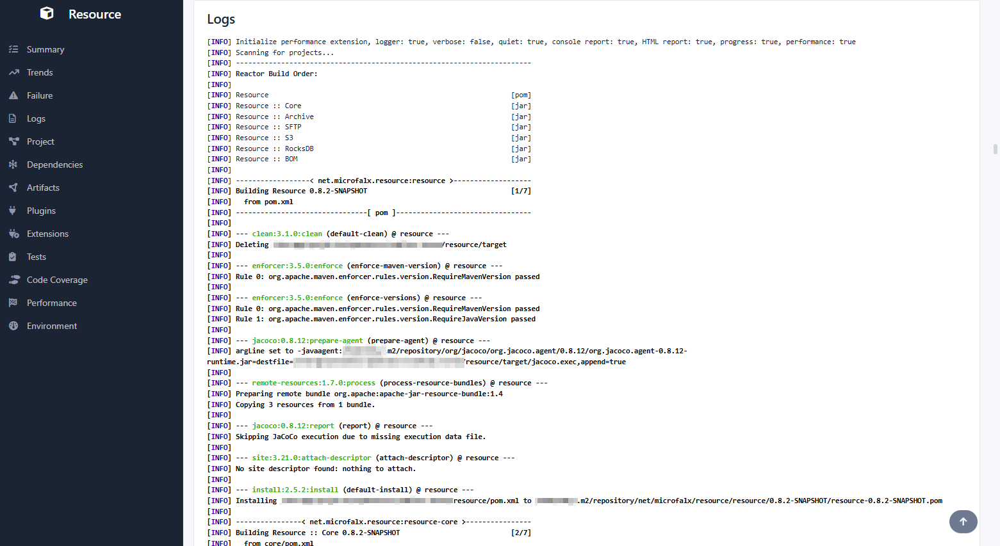

#### Project

This section provides key information about the project, including its name, description, artifact details, and properties from the top-level POM.


#### Dependencies

A comprehensive list of all project dependencies, including their transitive dependencies, is provided in this section. 

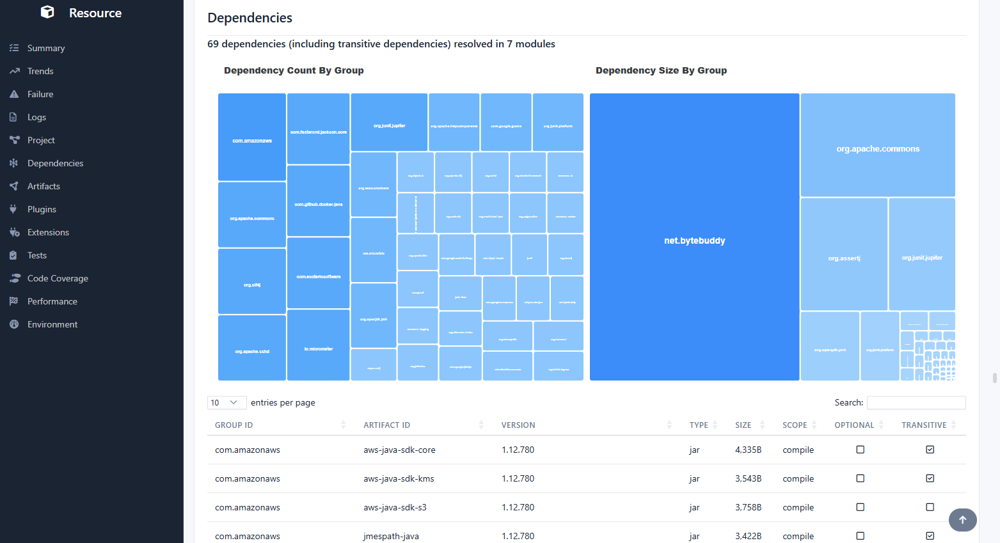

Additionally, several treemap charts illustrate the number and size of dependencies by group identifier.

#### Artifacts

Similar to the _Dependencies_ section, the artifacts section shows a list of artifacts retrieved from local and remote repositories. By default, it only includes dependencies that take more than 5 milliseconds during the build process.

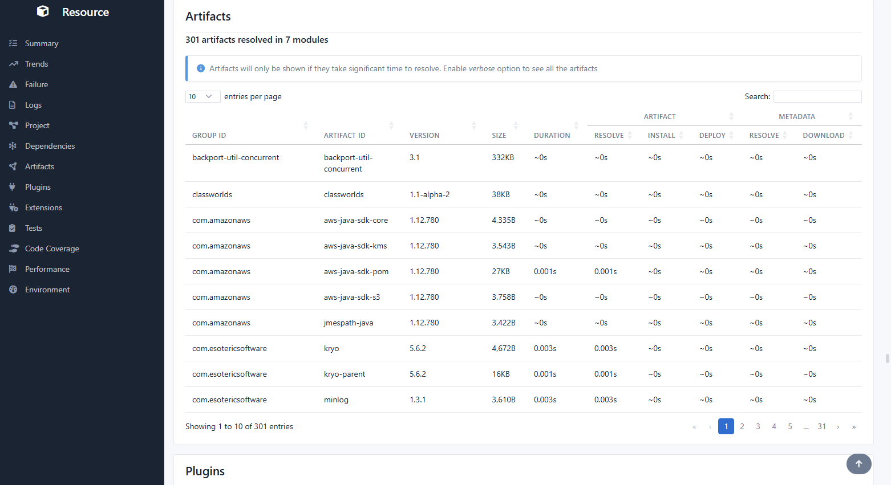

To visualize all artifacts, you can enable the `talos.verbose` option.

#### Plugins

This section displays all plugins used by the project, including their version, invoked goals, and execution time.

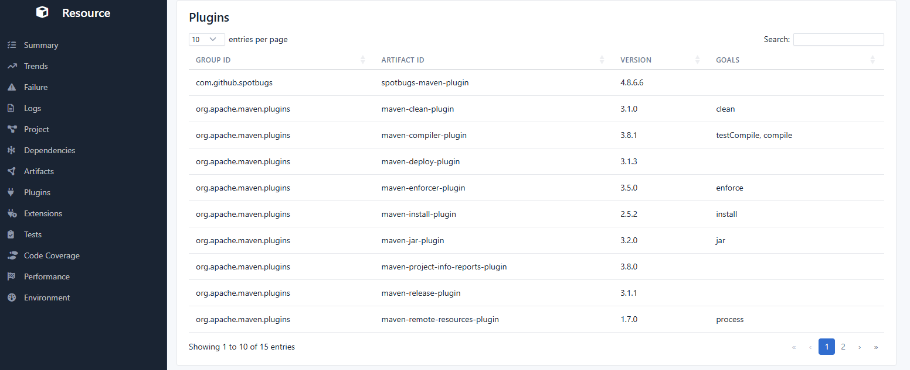

You can request more information about plugins by using the `talos.verbose` option.

#### Extensions

This section displays a list of all registered extensions, excluding the current extension. More importantly, it shows the duration of all non-zero events, along with their execution count, total duration, and average duration. This information is crucial for troubleshooting any significant time loss within the plugin.

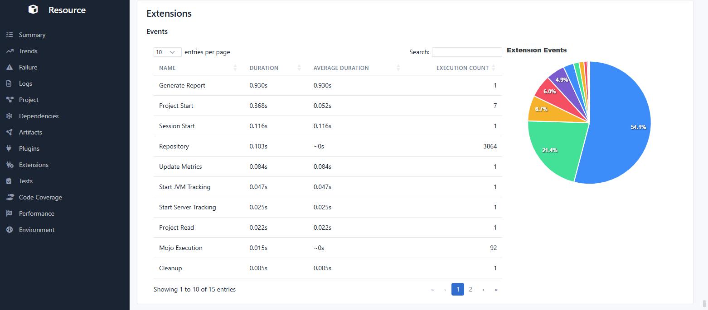

#### Tests

The _tests_ section begins with several charts that provide a summary of the tests from various perspectives:

* The number of tests conducted by module
* The number of failed tests by module
* The duration of tests by module
* Types of failures encountered
* A histogram showing execution times

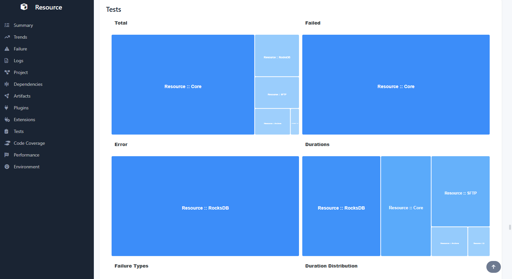

This section also includes a list of failed tests organized by module, along with the reasons for their failure. To help visualize all the tests—especially since large projects may have thousands or even tens of thousands of them—you can enable the `talos.verbose` option.

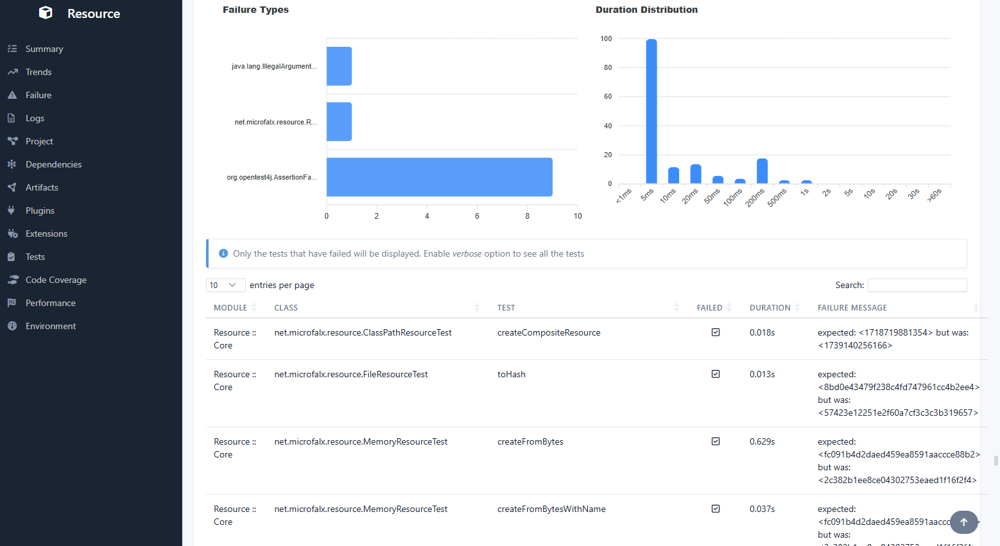

#### Performance

This section contains all the information needed to explain why a build session was slow. It includes server metrics and process metrics, and the charts provided here should help clarify the reasons behind the longer-than-usual build time.

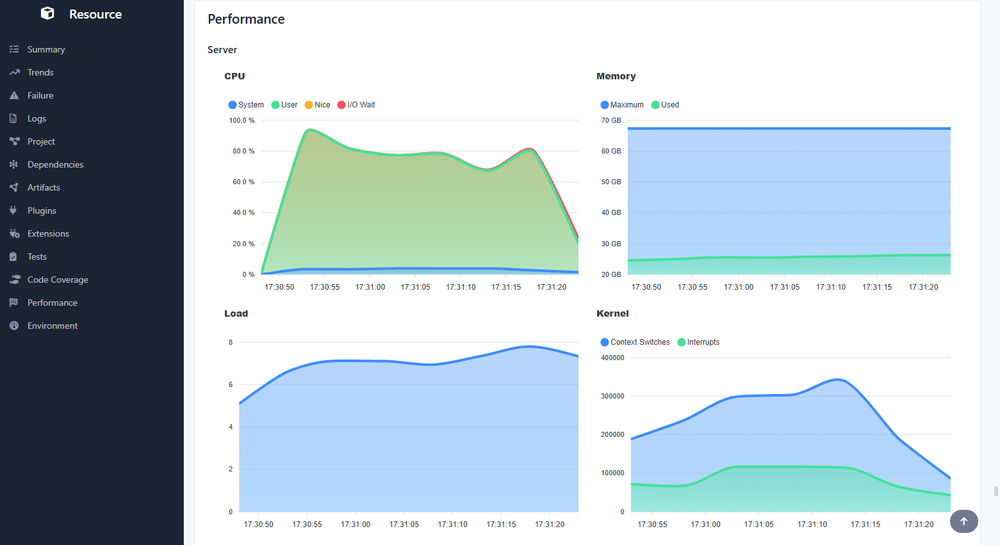

#### Environment

The _environment_ section provides an overview of the build environment, including aggregates of server and process metrics, as well as a list of all system properties utilized during the session.

Since most behaviors associated with a build session are influenced by system properties, this information can help identify any changes made between sessions that might have affected the results or performance of a build.

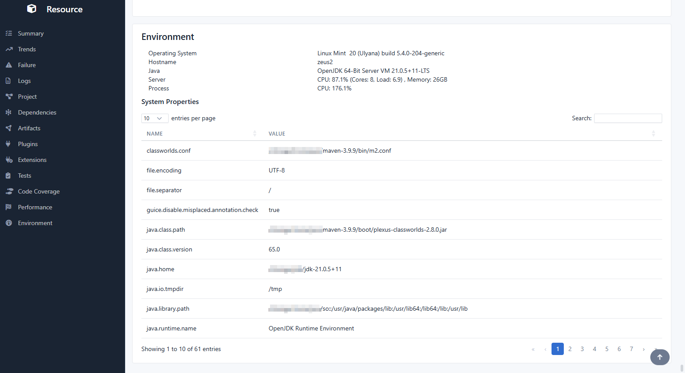

### Configuration

The behaviour of the extension can be changed with a few parameters:

* `talos.extension.enabled=false` Disables the extension without the need to be removed from extensions.xml (might be useful if the extension misbehaves)
* `talos.performance.enabled=false` Disables server & process performance monitoring (Performance reports in HTML)
* `talos.quiet=false` The default build behaviour is be reverted (verbose logging), while preserving the build report at the end
* `talos.verbose=true` The default output highlights the most important aspects of the build; however, additional information can be requested in the terminal in the build report at the end
* `talos.progress=false` The progress is disabled, and the build is fully quiet; The only thing displayed on the screen (console) would be the report at the end
* `talos.report.html.enabled=false` The HTML report will not be generated
* `talos.report.logs.enabled=false` The HTML report will not contain the logs
* `talos.report.trend.retention=NNd` The trend report will contain only the last NN days
* `talos.report.open` The HTML report will be open automatically in the browser at the end
* `talos.report.environment.enabled` The terminal will include the environment report at the end

Configuration can be passed using environment variables. The environment variable name is the configuration key in upper case and `.` replaced by `_`.

### External Storage

The extension can store session data, including trends and reports, in a remote file system (object store) using SFTP or S3 (self-hosting using [MinIO](https://min.io/)). This capability is essential when the build environment is not static or when multiple nodes are used to build projects. The following configuration options are available:

* `talos.storage.uri`: The URI of the remote file system.
* `talos.storage.username`: The username for accessing the remote file system.
* `talos.storage.password`: The password for accessing the remote file system.
* `talos.storage.s3.bucket`: The S3 bucket designated for storing the data (required for S3).
* `talos.storage.s3.prefix`: An optional prefix (path) to customize where the data is stored.
